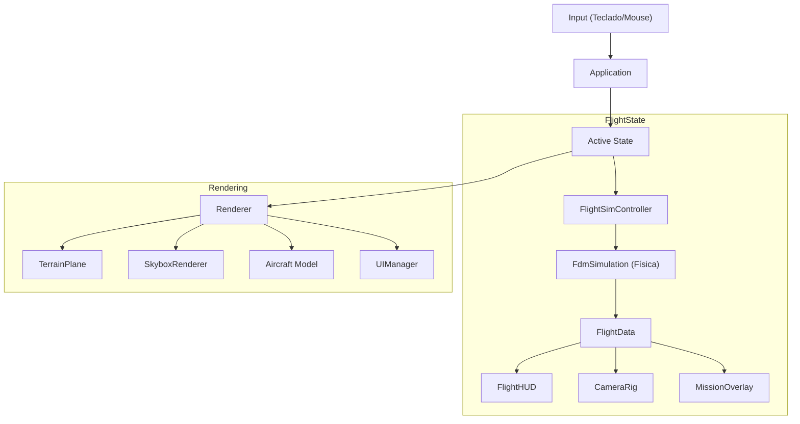

# Arquitectura General del Simulador

## 1. Introducción

El simulador está construido sobre C++17 y OpenGL 4.6, utilizando un diseño modular que separa claramente las responsabilidades. El punto de entrada es `src/main.cpp`, que inicializa el manejador de crashes y la clase principal `core::Application`.

## 2. Ciclo de Vida (`core::Application`)

La clase `core::Application` gestiona el ciclo de vida de la aplicación:

1.  **Inicialización (`init`)**:
    *   Configura GLFW y GLAD.
    *   Crea la ventana y el contexto OpenGL.
    *   Inicializa los subsistemas (Renderer, Input).
    *   Carga los recursos globales (Shaders, Modelos).

2.  **Bucle Principal (`run`)**:
    *   Calcula el `deltaTime` para independencia de frame-rate.
    *   Procesa eventos de entrada (`pollEvents`).
    *   Actualiza el estado activo (`update`).
    *   Renderiza el estado activo (`render`).
    *   Intercambia buffers (`swapBuffers`).

3.  **Limpieza (`cleanup`)**:
    *   Libera recursos de OpenGL y memoria.

## 3. Máquina de Estados (`src/states`)

El simulador utiliza un patrón **State** para gestionar las diferentes pantallas o modos de juego. Todos los estados heredan de la interfaz `states::IModeState`.

### Interfaz `IModeState`

```cpp
class IModeState {
public:
    virtual void onEnter() = 0;
    virtual void onExit() = 0;
    virtual void handleInput(float dt) = 0;
    virtual void update(float dt) = 0;
    virtual void render() = 0;
};
```

### Estados Implementados

1.  **`MenuState`**:
    *   Muestra el menú principal.
    *   Permite seleccionar misiones.
    *   Transiciona a `PlanningState` al elegir una misión.

2.  **`PlanningState`**:
    *   Muestra el planificador de misiones (`MissionPlanner`).
    *   Permite visualizar y modificar la ruta.
    *   Transiciona a `FlightState` al confirmar el despegue.

3.  **`FlightState`**:
    *   Ejecuta la simulación de vuelo.
    *   Actualiza la física, cámara y HUD.
    *   Puede volver al menú (`MenuState`) o reiniciar.

## 4. Contexto de Aplicación (`core::AppContext`)

Para evitar singletons globales o pasar demasiados parámetros, se utiliza una estructura `AppContext` que contiene punteros a los sistemas principales. Esta estructura se pasa a los estados y componentes que la necesitan.

```cpp
struct AppContext {
    GLFWwindow* window;

    // ... otros sistemas
};
```

## 5. Diagrama de Flujo de Datos



## 6. Puntos Clave para el Examen

*   **Polimorfismo**: Uso de `IModeState` para cambiar comportamientos en tiempo de ejecución.
*   **Inyección de Dependencias**: Uso de `AppContext` para compartir recursos.
*   **Separación de Lógica y Renderizado**: `FlightData` actúa como puente, permitiendo que el HUD y la física sean independientes.
