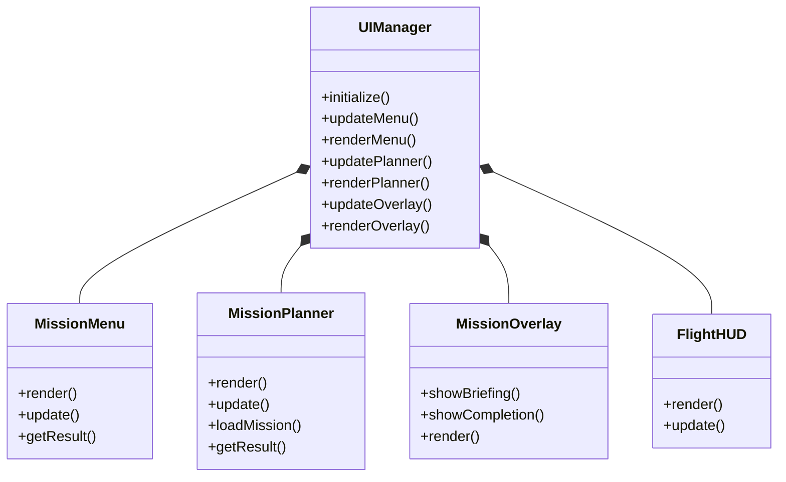

# Sistema de Interfaz de Usuario (UI)

Este módulo detalla la implementación de la interfaz de usuario del simulador, la cual gestiona la navegación fuera de la simulación de vuelo (menús, planificación) y la información superpuesta durante el vuelo (overlays).

> **Nota**: La instrumentación de vuelo (HUD) se detalla en `instrumentacion.md`. Este documento se centra en la infraestructura de UI general.

## 1. Arquitectura General

El sistema de UI está centralizado en la clase `ui::UIManager`, que actúa como orquestador principal. Su responsabilidad es instanciar, inicializar y coordinar los diferentes subsistemas de interfaz.

### Diagrama de Clases

## 2. Componentes Principales

### 2.1. UIManager (`src/ui/UIManager`)

Es el punto de entrada para `core::Application`. No maneja lógica de renderizado directo, sino que delega a los componentes especializados.

*   **Responsabilidades**:
    *   Mantener la propiedad (`std::unique_ptr`) de todos los paneles.
    *   Propagar eventos de redimensionamiento de ventana (`resize`).
    *   Proveer métodos de actualización y renderizado específicos para cada estado del juego (`Menu`, `Planning`, `Flight`).
    *   Conectar el `MissionRegistry` con los menús.

### 2.2. MissionMenu (`src/ui/menu/MissionMenu`)

Gestiona la pantalla de inicio y selección de misiones.

*   **Características**:
    *   Renderiza una lista scrolleable de misiones disponibles.
    *   Muestra detalles de la misión seleccionada (descripción, dificultad).
    *   Utiliza `gfx::TrueTypeFont` para renderizado de texto de alta calidad.
    *   **Input**: Soporta navegación por teclado (Flechas, Enter, ESC).
*   **Salida**: Retorna un `MenuResult` que indica si el usuario quiere salir de la app o iniciar una misión específica.

### 2.3. MissionPlanner (`src/ui/menu/MissionPlanner`)

Es el componente más complejo de la UI, permitiendo la edición visual de la ruta de vuelo antes del despegue.

*   **Vistas**:
    1.  **Mapa Táctico (XZ)**: Vista ortográfica superior donde se pueden arrastrar waypoints.
    2.  **Perfil de Vuelo (Altitud)**: Gráfico de altura vs distancia acumulada.
    3.  **Storyboard**: Tarjetas secuenciales con los pasos de la misión.
*   **Interacción**:
    *   **Drag & Drop**: Los waypoints se pueden mover con el mouse.
    *   **Teclado**: Ajuste fino de altitud y navegación.
    *   **Validación**: Impide iniciar misiones sin waypoints válidos.

### 2.4. MissionOverlay (`src/ui/overlay/MissionOverlay`)

Gestiona las ventanas modales que aparecen *sobre* la simulación 3D.

*   **Modos**:
    *   **Briefing**: Se muestra al entrar al estado de vuelo, pausando la simulación hasta que el usuario confirma. Muestra objetivos y condiciones climáticas.
    *   **Completion**: Se activa cuando `MissionRuntime` detecta el fin de la misión. Muestra estadísticas (tiempo, precisión) y opciones para volver al menú o continuar en vuelo libre.
*   **Renderizado**: Utiliza fondos semitransparentes para no perder contexto visual del simulador.

## 3. Tecnologías de Renderizado

La UI se construye sobre dos primitivas gráficas principales ubicadas en `src/gfx/rendering`:

1.  **`Renderer2D`**:
    *   Motor de batching para primitivas 2D (líneas, quads, círculos).
    *   Optimizado para reducir *draw calls*.
    *   Usa proyección ortográfica (`glm::ortho`) mapeada píxel a píxel con la resolución de ventana.

2.  **`TrueTypeFont`**:
    *   Implementación basada en `stb_truetype.h`.
    *   Genera texturas de atlas de fuentes en tiempo de ejecución.
    *   Permite texto escalable y nítido, esencial para la legibilidad de los instrumentos y menús.

## 4. Flujo de Datos

1.  `core::Application` inicializa `UIManager`.
2.  `UIManager` carga las misiones desde `MissionRegistry` y se las pasa a `MissionMenu`.
3.  Cuando el usuario selecciona una misión, `UIManager` transfiere la definición (`MissionDefinition`) al `MissionPlanner`.
4.  El usuario edita la misión en el Planner.
5.  Al confirmar, la misión editada se pasa al sistema de vuelo (`FlightState`), que a su vez alimenta al `MissionOverlay` para el briefing.
