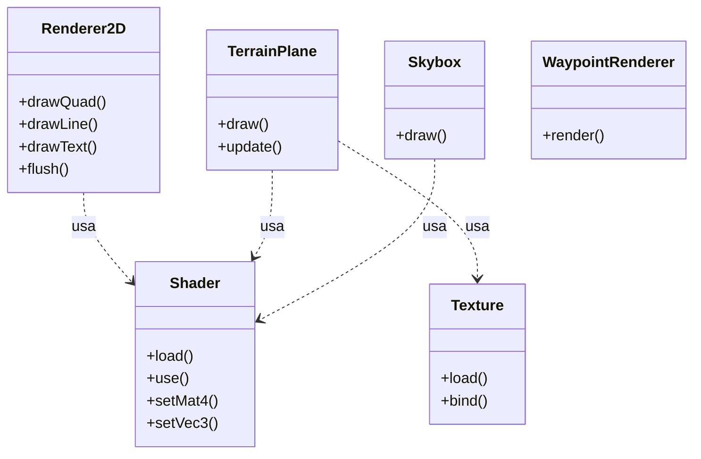

# Motor Gráfico (GFX)

Este módulo documenta el subsistema gráfico del simulador, ubicado en `src/gfx`. Este motor es responsable de todo el renderizado, tanto de la escena 3D (terreno, avión, cielo) como de la interfaz 2D (HUD, menús).

## 1. Arquitectura de Renderizado

El motor gráfico no es monolítico; está dividido en componentes especializados que manejan diferentes aspectos de la visualización.

### Diagrama de Componentes

## 2. Subsistemas Principales

### 2.1. Core (`src/gfx/core`)

Contiene las abstracciones de bajo nivel de OpenGL.

*   **`Shader`**: Encapsula la compilación y linkeo de programas GLSL. Provee una interfaz limpia para setear uniforms (`setBool`, `setInt`, `setFloat`, `setMat4`).
*   **`Texture`**: Maneja la carga de imágenes (usando `stb_image`) y la configuración de parámetros de textura (filtros, wrapping).
*   **`Mesh`**: Abstracción para VAO/VBO/EBO. Permite cargar modelos simples.

### 2.2. Rendering 2D (`src/gfx/rendering`)

Es el motor detrás del HUD y la UI.

*   **`Renderer2D`**:
    *   Implementa un **Batch Renderer**. En lugar de hacer una *draw call* por cada línea o cuadro, acumula vértices en un buffer dinámico y los dibuja todos juntos al final del frame (`flush`).
    *   Esto es crítico para el rendimiento del HUD, que puede tener cientos de elementos vectoriales.
    *   Soporta primitivas como: Líneas, Rectángulos (rellenos y bordes), Círculos y Texto.
*   **`TrueTypeFont`**:
    *   Carga fuentes `.ttf` y genera un atlas de texturas.
    *   Permite renderizar texto con kerning correcto y escalado sin pérdida de calidad.

### 2.3. Terreno (`src/gfx/terrain`)

Maneja la visualización del mundo.

*   **`TerrainPlane`**:
    *   Implementa la técnica de **Infinite Plane**.
    *   No carga un modelo 3D gigante. En su lugar, renderiza una cuadrícula de 3x3 planos que se mueven con el avión.
    *   Usa **UV Tiling** para repetir la textura del suelo, creando la ilusión de un mundo infinito.
    *   Aplica **Niebla (Fog)** en el fragment shader para ocultar los bordes del plano y dar sensación de profundidad atmosférica.

### 2.4. Cielo (`src/gfx/skybox`)

*   **`Skybox`**:
    *   Renderiza un cubo gigante alrededor de la cámara.
    *   Usa un `Cubemap` (6 texturas) para simular el cielo en todas direcciones.
    *   Se dibuja primero (o último con trucos de Z-buffer) para que siempre esté "detrás" de todo.

### 2.5. Waypoints (`src/gfx/WaypointRenderer.cpp`)

*   Sistema especializado para dibujar los marcadores de navegación en el mundo 3D.
*   Dibuja "pilares" de luz verticales en las coordenadas de los waypoints activos.
*   Maneja la transparencia y el color según si es el waypoint activo o uno futuro.

## 3. Shaders

Los shaders (ubicados en `shaders/`) son programas que corren en la GPU. El motor los gestiona y recarga.

*   **`model.vert/frag`**: Iluminación Blinn-Phong para el avión.
*   **`terrain_plane.vert/frag`**: Tiling de texturas y niebla para el suelo.
*   **`hud.vert/frag`**: Renderizado de colores planos y texturas para la UI 2D.
*   **`skybox.vert/frag`**: Renderizado del cubemap del cielo.

## 4. Optimizaciones Implementadas

1.  **Batching 2D**: Reduce drásticamente el overhead de CPU al dibujar el HUD.
2.  **Texture Atlas**: Para fuentes, evitando cambios de estado de textura constantes.
3.  **Geometry Reuse**: El terreno recicla la misma geometría de plano, solo cambiando su matriz de modelo.
4.  **State Caching**: (Implícito) El diseño evita cambios innecesarios de Shader o VAO.
