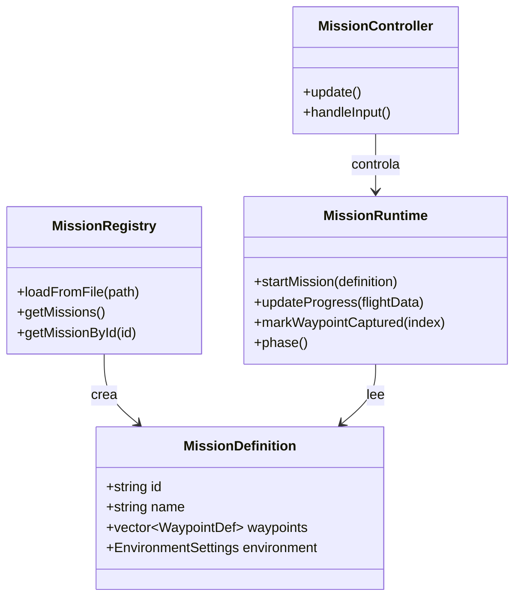

# Sistema de Misiones

Este módulo es el cerebro lógico del juego. Define qué es una misión, cómo se carga desde el disco y cómo se ejecuta en tiempo real.

## 1. Arquitectura del Sistema

El sistema de misiones está diseñado para ser **Data-Driven**. Esto significa que las misiones no están hardcodeadas en C++, sino que se definen en archivos externos (JSON), permitiendo crear nuevo contenido sin recompilar.

### Diagrama de Clases

## 2. Estructuras de Datos (`MissionDefinition.h`)

La estructura `MissionDefinition` es un Plain Old Data (POD) struct que contiene toda la información estática de una misión.

*   **Identificación**: `id`, `name`, `description`, `briefing`.
*   **Navegación**: `std::vector<WaypointDef> waypoints`. Cada waypoint tiene posición 3D y nombre.
*   **Ambiente**: `EnvironmentSettings` define hora del día, clima y viento.
*   **Configuración de Inicio**: Posición y orientación inicial del avión (`startPosition`, `startOrientation`).

## 3. Persistencia y Parsing (`MissionRegistry`)

Para evitar dependencias externas pesadas, implementamos un **Parser JSON Custom** en `MissionRegistry.cpp`.

### Lógica de Parsing Manual
El parser lee el archivo carácter por carácter y extrae objetos anidados contando llaves `{}`.
1.  Busca el array `"missions"`.
2.  Itera sobre cada objeto dentro del array.
3.  Usa helpers como `extractJsonString` y `extractJsonFloat` para obtener valores por clave.
4.  Soporta estructuras anidadas para `waypoints` y `environment`.

> **Nota de Implementación**: Esta decisión de diseño reduce el tamaño del ejecutable y elimina la necesidad de librerías como `nlohmann/json` o `RapidJSON`, demostrando control sobre el manejo de strings en C++.

## 4. Lógica de Ejecución (`MissionRuntime`)

`MissionRuntime` es una máquina de estados que gestiona el ciclo de vida de una misión activa.

### Fases de la Misión (`MissionPhase`)
1.  **Briefing**: El simulador está pausado (o en cámara lenta). Se muestra el overlay con objetivos.
2.  **InProgress**: El jugador tiene control. El sistema monitorea la distancia a los waypoints.
3.  **Completed**: Se cumplieron todos los objetivos. Se muestra el resumen de desempeño.
4.  **FreeFlight**: El jugador decide seguir volando sin objetivos.

### Sistema de Captura de Waypoints
En cada frame (`updateProgress`), el runtime calcula la distancia entre el avión y el waypoint activo.
*   Si `distancia < radio_captura` (ej. 100m), el waypoint se marca como capturado.
*   El índice `activeWaypointIndex_` avanza al siguiente.
*   Si no quedan waypoints, se dispara `markCompletion()`.

## 5. Métricas de Rendimiento

El sistema recolecta datos durante el vuelo para el debriefing:
*   **Tiempo Total**: Duración desde el despegue hasta el último waypoint.
*   **Precisión**: Porcentaje de waypoints capturados (actualmente es binario, se capturan todos o no se termina).
*   **Velocidad Promedio**: Calculada acumulando muestras de velocidad cada frame.

## 6. Integración con otros Sistemas

*   **Física**: `FlightSimulationController` consulta a `MissionRuntime` si debe aplicar condiciones iniciales (resetear posición).
*   **UI**: `MissionOverlay` lee el estado de `MissionRuntime` para saber si mostrar el briefing o la pantalla de éxito.
*   **Gráficos**: `WaypointRenderer` pide la lista de waypoints activos para dibujarlos en el mundo 3D.
